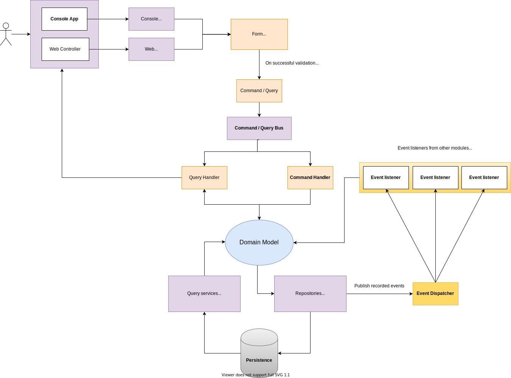
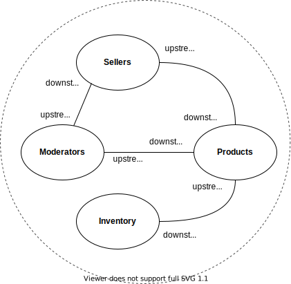
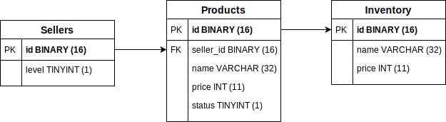

# PHP Developer  Evaluation Project
This is a sample project for evaluating potential candidates applying for developer positions at [ThinkWeb](https://www.thinkweb.bg).

## Important

- Assume that there is a [dependency injection](https://en.wikipedia.org/wiki/Dependency_injection) container (see [PSR-11](https://www.php-fig.org/psr/psr-11/)) that auto wires all constructor dependencies and injects the implementations of the right interfaces. `Controllers`, `CommandHandlers`, `QueryHandlers` and `EventListeners` are fetched from this DI container, nothing else. 
- Assume that all `EventListeners` are automatically registered with the `EventDispatcher`;
- [CQS](https://en.wikipedia.org/wiki/Command%E2%80%93query_separation) for methods and use cases; Command names are constructed using the following naming pattern,  `DeleteProduct` (imperative) and handlers are `DeleteProductHandler`. Assume the command bus automatically matches the right handler using the naming pattern and handles the command;
- Commands, queries, and events must be [immutable](https://en.wikipedia.org/wiki/Immutable_object);
- The query/read side of the project is intentionally ignored and is outside the scope of the assignment;

## Transaction context
Assume that the transaction context is a single command handler and all event listeners for the published events upon the successful persistence of the model. If all succeed the data is persisted, otherwise the transaction is rolled back.

Note: Command handlers perform operations on the domain model. Entities record events that are published once the entity is persisted. Once the events are published, event listeners, if any, are executed. If an exception is triggered anywhere along the path, the whole operation fails and the transaction is rolled back.

### Folder structure
- **Domain** - Business logic, entities, repositories, domain services, events, value objects...;
- **Application** - Use cases in the form of commands and queries, event listeners, application services...;
- **Infrastructure** - Concrete implementations of repositories, query services, HTTP controllers/console commands; 

## Project info
The project represents a part of a marketplace where **sellers** can **list products**. All newly listed products are scheduled for review by Moderators (outside the scope of this example).
Once a moderator **approves** a product, it **turns into inventory**.
There are 4 main modules in the application:
- Moderators;
- Sellers;
- Products;
- Inventory;

Tip: Upstream services/modules don't need to know or care about the existence of downstream services/modules.

### Products
- Products can be created with name and price;
- Product price can be between 0.01 and 10.00, the currency is not used for simplicity;
- Product names must be 2 to 32 characters;
- A newly created product is marked **for review**. Once reviewed it is added to the inventory;
- If the product is renamed it is marked for review until approved the old name is used in the inventory context;
- If the product price changes, a review is not needed;
- Once the product is scheduled for deletion it is removed from the inventory;
- Each seller can manage only his products;
- Only products scheduled for deletion can be deleted;

### Inventory
- Inventory is all the products that have been approved;
- Moderation is manual action;

## Database schema
The database schema is given just as a reference.

## TODO 
- Implement a "delete seller" use case; 
- If the seller has products in the inventory (Products with status "LISTED"), the moderator should not be able to delete the seller;
- **Optional / Bonus points** &mdash; Try to minimize the dependencies between the modules. Products know about sellers but do sellers need to know about products? <strong>Answer:</strong> No. We want to minimize the dependencies between separated microservices.
- Igit smplement a business rule that a seller can't be upgraded to GOLD if he registered less than 30 days ago.

## Need more info
We do not expect you to fully understand the business logic of the application, so **feel free to ask as many questions as you want**. 

## Confidentiality
This code and all accompanying information are considered Confidential Information provided to applicants (Recipients) in relation to the candidate evaluation process (Disclosure Purpose).
Under no circumstances the Recipient is allowed to reproduce, copy or disclose the Confidential Information and shall take all action necessary to maintain the confidential nature of the Confidential Information.
The Recipient must not use the Confidential Information beyond the reason described as the Disclosure Purpose.

## Copyright
© 2025 ThinkWeb Bulgaria OOD. All rights reserved.
